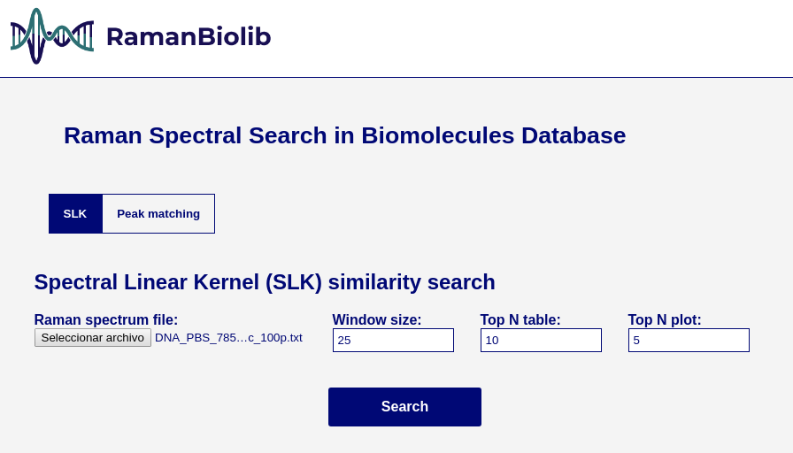
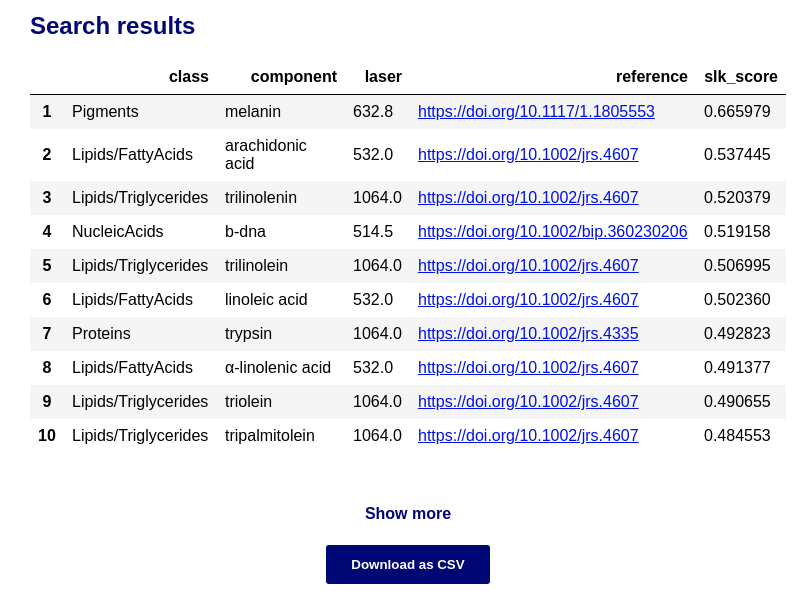
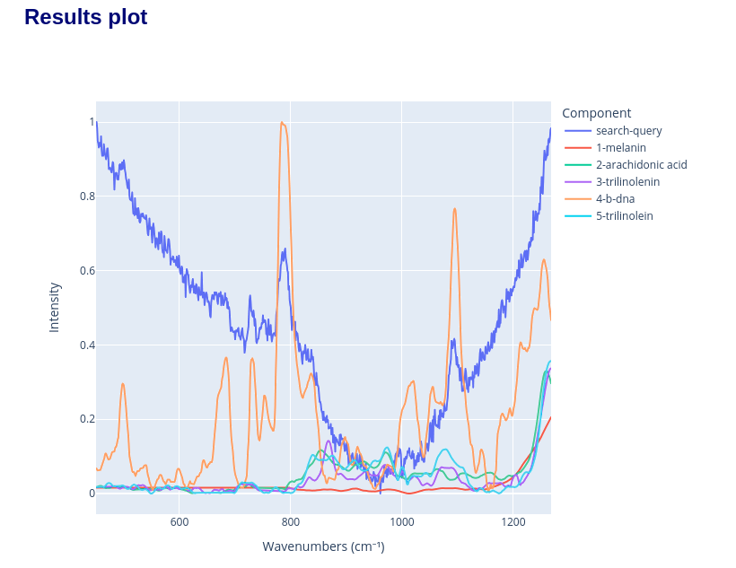
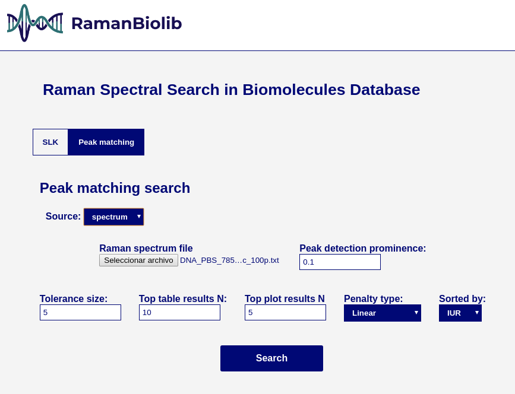
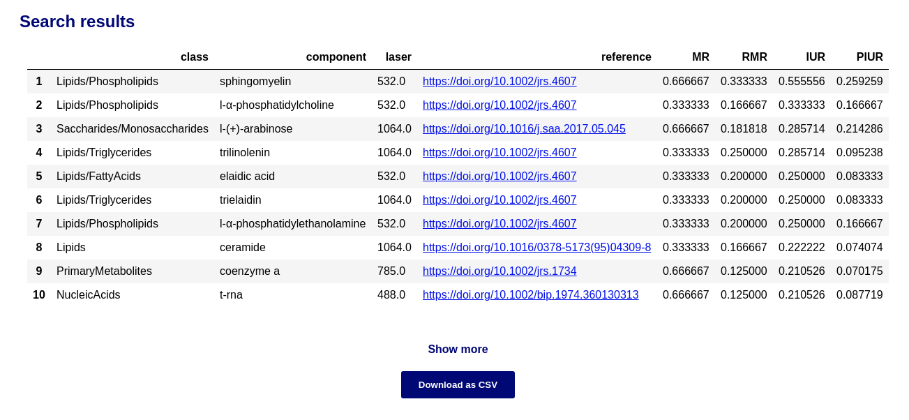
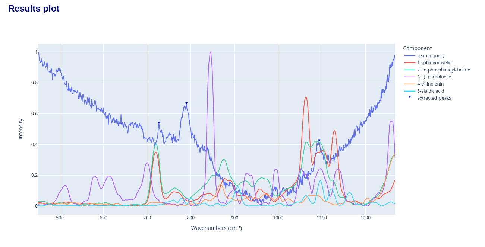

<picture align="center">
  
</picture>

# RamanBiolib UI: A standalone UI for Biomolecule Identifiaction by means of Raman Spectroscopy using RamanBiolib 

## Getting started

Download the app executable file and start using RamanBiolib.

## How to use this tool

### Spectral Linear Kernel (SLK) similarity search

This uses the full spectra plot to rank the database components by its SLK similarity to the unknown specturm.

Parameters:
- **Raman spectrum file**: the unnknown spectrum file containing the wavenumbers and intensity.
- **Window size**: the value of the window (W) parameter in SLK.
- **Top N table**: the number of components to show in the result table.
- **Top N plot**: the number of components to show in the result plot.

The search results display the ranked table of the most similar biomolecules in the RamanBiolib database:

and the spectra comparison plot:

### Peak matching search

This matching calculate the matching between the specturm extracted peak positions and each database component peak positions.

Parameters:

- **Source:**
    - **spectrum**: the source is a spectrum file (as in SLK similarity search)
        - **Raman spectrum file**: the unnknown spectrum file containing the wavenumbers and intensity.
        - **Peak detection prominence**: the min prominence threshold for peak detection of the uploaded spectrum once the specturm is min-max normalized. The peak detection is done using scipy find_peaks function.
    - **peaks list**: 
        - **Peaks wavenumbers**: the source is a comma-separated list of peaks wavenumbers positions (cm⁻¹). Example: 100,500,652,1205,1652 (step=1cm⁻¹, min=450, max=1800)
- **Tolerance size**: the simmetrical maximum distance tolerance for peak matching.
- **Penalty type**: the penalty function for PIUR calculation. Linear or Inverse power (1/x).
- **Sorted by**: the metric used to sort the results (IUR, MR, RMR, PIUR). Default IUR. 
- **Top N table**: the number of components to show in the result table.
- **Top N plot**: the number of components to show in the result plot.

The search results display the ranked table of the most similar biomolecules in the RamanBiolib database:

and the spectra comparison plot:

## How to cite this tool

If you use this tool for research, please cite us:

## License

[GNU GPL v3](./LICENSE)